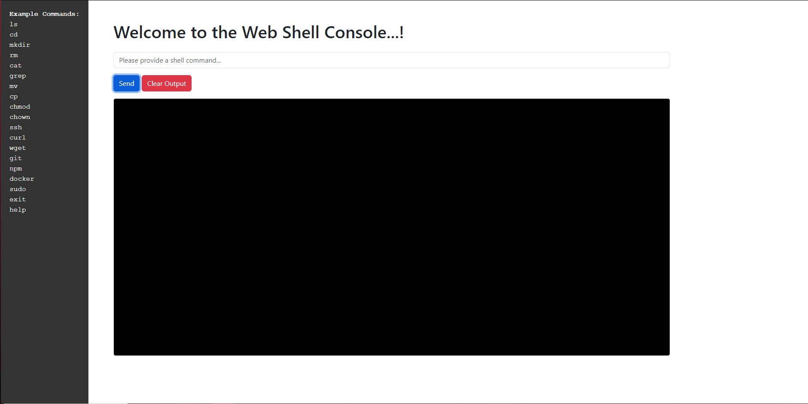

# Linux Web Shell Console

Here you have the opportunity to start, edit, and further develop a web-based Linux shell console. All tests have been successful, and everything should be functional.

## What do I need to do first?

Firstly, you need to install all the necessary packages like Node.js and its associated libraries.
```
apt install nodejs
npm install socket.io
npm install express
```

Once youve done that, you can create a folder on your system and put the downloaded files in it.
That should be enough, and everything should be ready now. You can open the `app.js` file and adjust it according to your needs.
You can edit, further develop, or do whatever you like with all the files at any time.

When youre ready, you can start the web server with `node app.js`, and you should be able to access the page using your servers **IP** address or **domain**.

Have fun with the "little thing" and good luck.

> [!CAUTION]
> Please be careful, its risky to operate this publicly. Please use a login system to access the web console and also use a secure port. Thank you.



